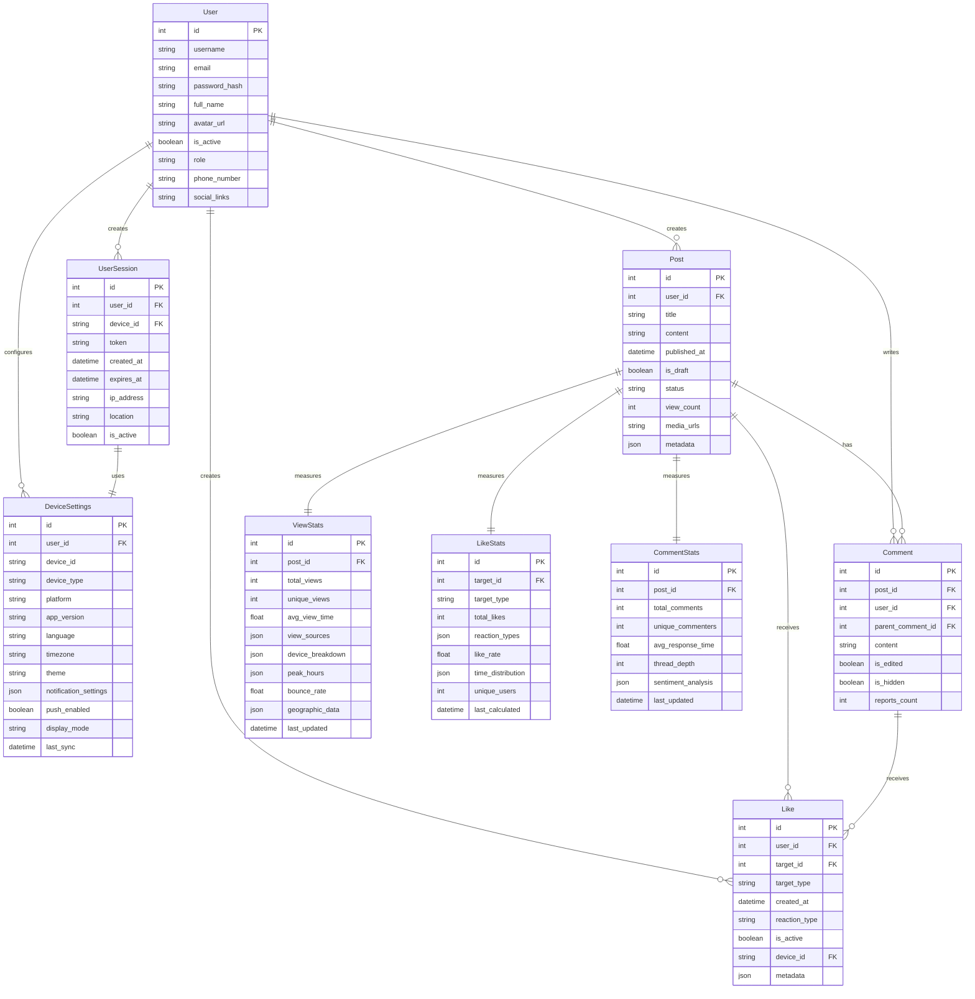

# ER-Диаграмма

```mermaid
%%{init: {
  "theme": "default",
  "themeCSS": [
    "[id^=entity-User] .er.entityBox { fill: lightgreen;} ",
    "[id^=entity-UserSession] .er.entityBox { fill: lightgreen;} ",
    "[id^=entity-DeviceSettings] .er.entityBox { fill: lightgreen;} ",
    "[id^=entity-Post] .er.entityBox { fill: powderblue;} ",
    "[id^=entity-Comment] .er.entityBox { fill: powderblue;} ",
    "[id^=entity-Like] .er.entityBox { fill: powderblue;} ",
    "[id^=entity-ViewStats] .er.entityBox { fill: pink;} ",
    "[id^=entity-LikeStats] .er.entityBox { fill: pink;} ",
    "[id^=entity-CommentStats] .er.entityBox { fill: pink;} ",
    "[id^=entity-UserActivity] .er.entityBox { fill: pink;} "
    ]
}}%%
erDiagram
    %% User Service
    User {
        int id PK
        string username
        string email
        string password_hash
        string full_name
        string avatar_url
        boolean is_active
        string role
        string phone_number
        string social_links
    }
    UserSession {
        int id PK
        int user_id FK
        string device_id FK
        string token
        datetime created_at
        datetime expires_at
        string ip_address
        string location
        boolean is_active
    }
    DeviceSettings {
        int id PK
        int user_id FK
        string device_id
        string device_type
        string platform
        string app_version
        string language
        string timezone
        string theme
        json notification_settings
        boolean push_enabled
        string display_mode
        datetime last_sync
    }

    User ||--o{ UserSession : creates
    User ||--o{ DeviceSettings : configures
    UserSession ||--|| DeviceSettings : uses

    %% Post Service
    Post {
        int id PK
        int user_id FK
        string title
        string content
        datetime published_at
        boolean is_draft
        string status
        int view_count
        string media_urls
        json metadata
    }
    Comment {
        int id PK
        int post_id FK
        int user_id FK
        int parent_comment_id FK
        string content
        boolean is_edited
        boolean is_hidden
        int reports_count
    }
    Like {
        int id PK
        int user_id FK
        int target_id FK
        string target_type
        datetime created_at
        string reaction_type
        boolean is_active
        string device_id FK
        json metadata
    }
    User ||--o{ Post : creates
    User ||--o{ Comment : writes
    Post ||--o{ Comment : has
    User ||--o{ Like : creates
    Post ||--o{ Like : receives
    Comment ||--o{ Like : receives

    %%  Service
    ViewStats {
        int id PK
        int post_id FK
        int total_views
        int unique_views
        float avg_view_time
        json view_sources
        json device_breakdown
        json peak_hours
        float bounce_rate
        json geographic_data
        datetime last_updated
    }
    LikeStats {
        int id PK
        int target_id FK
        string target_type
        int total_likes
        json reaction_types
        float like_rate
        json time_distribution
        int unique_users
        datetime last_calculated
    }
    CommentStats {
        int id PK
        int post_id FK
        int total_comments
        int unique_commenters
        float avg_response_time
        int thread_depth
        json sentiment_analysis
        datetime last_updated
    }
    Post ||--|| ViewStats : measures
    Post ||--|| LikeStats : measures
    Post ||--|| CommentStats : measures
```